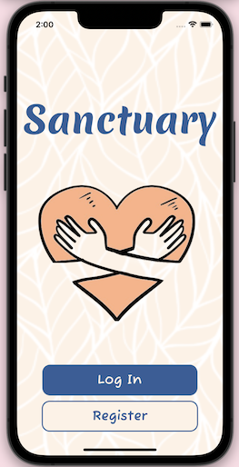
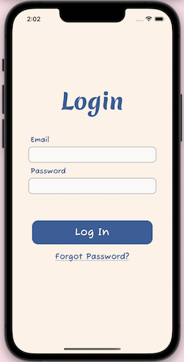
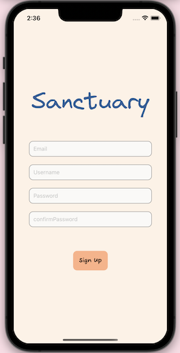
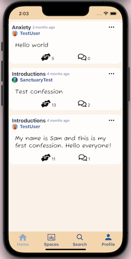
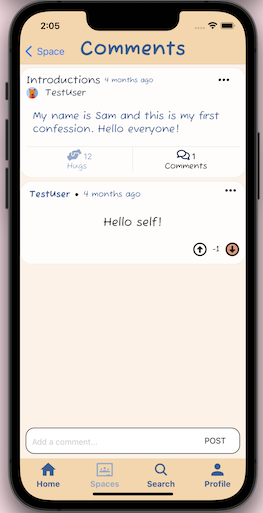
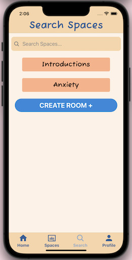
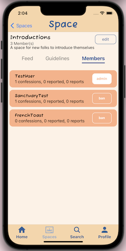
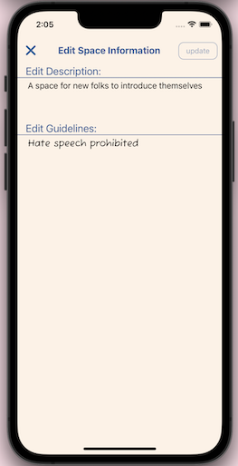

# Sanctuary

“Find your sanctuary, speak your truth”
## Introduction

Sanctuary is a mobile social media application featuring user-curated discussion spaces designed to calm the mind and encourage community support. Sanctuary is highly scalable, originally designed for a mental health counseling practice wishing to expand its online presence and serve its clients online, but is open to the general public and is capable of supporting a large number of simultaneous users.

## Technologies Used

This application is written in JavaScript and uses:
* React Native
* Expo Go
* Node
* Firebase
* Axios

## Welcome & Authentication

   

The welcome screen loads the authentication component, which verifies new and existing users. Any user may:
* Create a new account with their email and password
* Choose their own account username and icon
* Log into an existing account
* Reset their password from the login screen

## Home

The home screen displays all posts (called "confessions" in Sanctuary) in all the rooms that the user is a member of. This screen offers the following capabilites:
* User can "hug" a confession by pressing the handshake icon
* User can report a confession by pressing the 3 dots icon in the upper right corner of the confession, then pressing the red "Report" button shown in the screenshot above
* User can view the comments on a particular confession by pressing the speech bubbles icon

For each confession, the home screen displays the number of "hugs" it has received, and the number of comments posted to the confession.

## Comments

Comments display the username, the message, how long ago it was posted, an options button that slides up a modal with additional features such as reporting, and the current vote count with the option to upvote or downvote a comment.

**Comments Page Features**
* Comments display information such as username, body text, how long it was posted, and vote count
  * Time ago posted is updated live using the 'moment' module
* Ability to upvote or downvote a comment once
  * Comments under a confession are sorted by vote count from greatest to least, top to bottom
* Comments have an options button that slides up a modal with additional features such as reporting
  * Reported comments will send notifications to the owner of the space who will be able to view the comment and/or ban the user.
* Utilized lazy loading with Flat List to improve app performance and increase comment load times
## Spaces

**Spaces List**

- Renders links to spaces the user has created and joined.
- Used Dimensions object to incorporate window-width into styling.
- Used RefreshControl to refetch spaces from the database.

**Admin View**

 

- Edit Modal: allows user to change space description and guidelines
- Members Tab: allows user to view list of users who've joined the space with member presence information
  - Number of confessions the user made in the space
  - Number of times the user was reported by another user
  - Number of times the user reported another user
- Member Ban: Admin can ban members, and remove all of the user's comments and confessions from the space and prevent the banned user from accessing the space.

**General User View**

- Leave/Join: Users can leave and join spaces. Joining a space updates user’s home feed with confessions from the space and makes space more easily accessible in the Spaces Tab Screen
- Write Confession Modal: Users can create confessions.
- Feed Tab: renders confession module with a refresh control to refetch confessions from the database.

## Profile

https://user-images.githubusercontent.com/37416800/214449270-e43a9e6b-08c8-496b-a32f-b414bc1bc42c.mp4

From the **profile page**, users have the..
* Ability to view account details (eg username, avatar)
* Ability to view spaces the user has joined or created
  * If the user is viewing Joined Spaces, they will be able to see which spaces they are an admin for
  * Names for each space will be shown, alongside the corresponding number of members in each space
  * Users may also go directly to view the space by clicking on “View Space”
* Ability to search through the spaces listed under “Joined” or “Created” spaces⋅⋅⋅
  * This becomes sticky so that users can easily access search while browsing spaces on the profile page.
* Ability to log out of the account
* Ability to see unread notifications and access their notifications page⋅⋅

## Notifications

*Note: Notifications are accessible only from Profile page*

From the **notification features**, users have the..
* Ability to view the following types of notifications:
  * When the current user’s comment or confession has been reported by another user
  * When a comment or confession has been reported by a user within a space of which the current user is an admin of
* Ability to view the corresponding comments/confessions
* Ability to ban the member from the corresponding space from which the comment or confession was reported
  * Banning a user will remove the corresponding user’s comments/confessions from the corresponding space
  * The banned user will no longer be able to access the corresponding space via search or their spaces lists on the profile page

## Account Management

The account management component enables users to manage their existing account. Any user may
* Update their password after submitting their old password
* Change their user icon

## UX

See initial wireframes [here](https://docs.google.com/document/d/1D0CevEq6Vk95bZJ3TnJIBEjQZrdz-UBjExdb_Y0d_Hk/edit?usp=sharing)

## Installation

1. Install packages using the following command

	`npm install`

2. Initialize the application

	`npm start`

3. Download the mobile application Expo Go

4. Open Sanctuary through Expo Go by scanning the given QR code from your phone

## Team

* **Max Peterson - Product Manager**
  * https://www.linkedin.com/in/maxpeterson-swe
  * https://github.com/maxpeterson96
* **Chad Fusco - Software Architect**
  * https://www.linkedin.com/in/chadfusco
  * https://github.com/ChadFusco
* **Joseph Soto - UI Design**
  * https://www.linkedin.com/in/joseph-soto66/
  * https://github.com/sotojn
* **Kimberly Cheung**
  * https://www.linkedin.com/in/kimberlywycheung
  * https://github.com/kimberlywycheung
* **Warren Siu**
  * https://www.linkedin.com/in/warrensiu
  * https://github.com/warrensiu
* **Sai Vemireddy**
  * https://www.linkedin.com/in/sai-vemireddy
  * https://github.com/svemi
* **Justin Chong**
  * https://www.linkedin.com/in/justinjchong/
  * https://github.com/justinjchong
